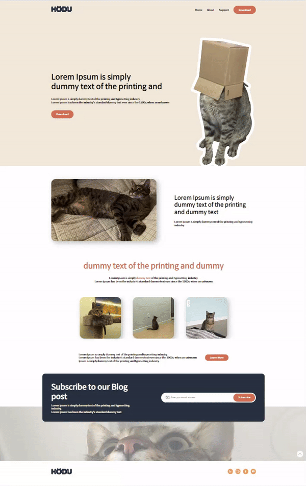
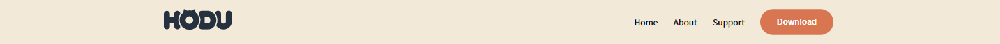
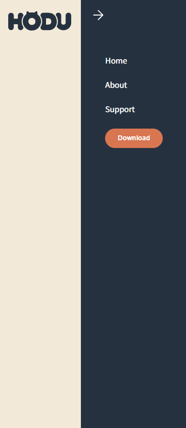
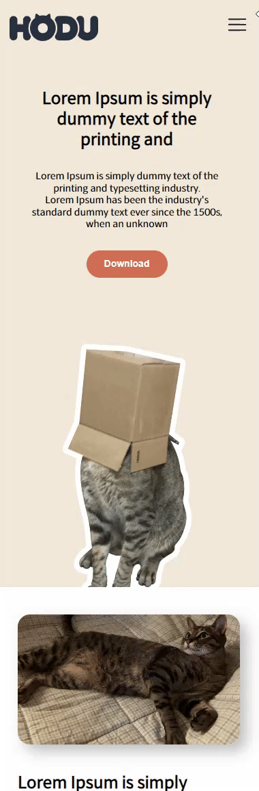
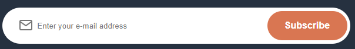
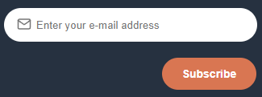
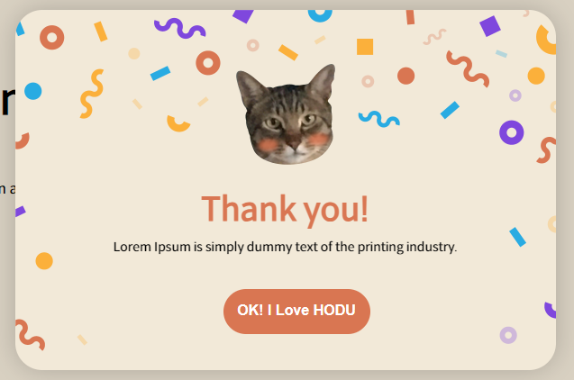
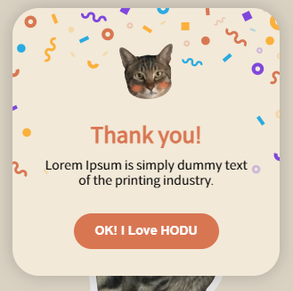

# 📝Project02 : Hodu-Landing_page

### 랜딩페이지

> 고객이 링크로 들어왔을 때 제일 처음 보여주는 페이지. 상품 서비스 홍보를 위한 마케팅 및 광고가 포함되어 있어야 한다.

## 기능

- PC/Mobile등의 스크린으로 확인 가능한 반응형 웹 구현
- Hodu 로고 및 메뉴바 고정하여 스크롤시 항상 위에 떠있도록 구현
- 메뉴 UI를 PC와 Mobile 다르게 구현 (PC는 바로 전체 메뉴 확인 가능 / Mobile 메뉴 버튼 눌러야 확인 가능)
- Mobile 메뉴 버튼 선택 시 사이드바 나오도록 구현
- Hodu 프로그램 다운로드 링크 연결
- Hodu 소개와 다양한 사진 확인 가능
- Hodu Blog post 구독 가능한 모달 창 구현
- Hodu 관련 SNS 링크 연결

구현하지 못한 기능 : 메뉴 사이드바 기능(JS) (현재는 PC버전의 메뉴`<nav>`와 Mobile 버전의 메뉴`<deatils> 내 <nav>`를 각각 사용하여 구현하였다.)

## 배포 URL

https://jini0012.github.io/Hodu-landing_page/

## 사용 언어

HTML, CSS

## 화면

|          📝           |                    PC                     |                                      Mobile                                      |
| :-------------------: | :---------------------------------------: | :------------------------------------------------------------------------------: |
|         main          |       |                                          |
|        header         |     |                                        |
| menu-open (mobile) |                   none                    |  |
|       modal-btn       |  |                                     |
|         modal         |      |                                         |

## 개발하며 느낀점

- 첫 프로젝트에서 Mobile 화면 구현에서 막혔던 것이 생각나서 이번엔
  Mobile 화면 부터 구현해 보았다 .. 마찬가지로 쉽지 않았다
- 아직 JS를 모르는 상태에서 사이드바를 구현하기가 너무 어려웠던 것 같다. 그래서 이부분은 토글 태그`details`를 사용하여 구현해보았다. 아직 부족한 부분이 많지만 디자인적으로라도 구현해내서 다행이고🥹🙏 상상만 해서 html을 작성해보았는데 CSS로 막상 구현이 되니까 너무 행복했다😆
- 사진을 올리고 크기를 조정했을 때 사진 자체의 위치를 조정하고 싶었는데 `object-position`을 알게되어 수정할 수 있었다. 이렇게 또 하나씩 알아가서 너무 좋고 앞으로도 잘 써먹을 것 같다👍
- 당연히 많이 연습해야하는 부분이겠지만 어떤 부분은 `flex`로 쓰는게 좀 익숙해졌고 편하고 어떤 부분은 `grid`가 편해서 둘 중 하나를 더 열심히 파보면 좋을 텐데 아직 이도 저도 아닌 느낌이라 좀 속상하다..🥹
- 코드 작성할 때 중복 작성해서 너무 길어지는 부분이 많다. 이 습관은 고칠 수 있도록 노력 많이해야겠다.🥲😤💪
- 호두 너무 귀엽다..😺
